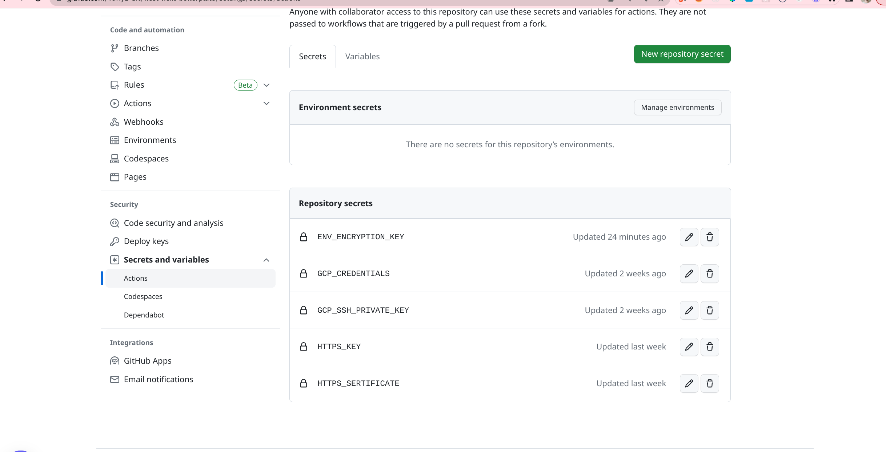

1. Add VM_USER_NAME action variable
   

Add secrets:

###

Setup google cloud as described here https://github.com/google-github-actions/ssh-compute

3. Add GCP_CREDENTIALS
   
   Account should be setup as described above and attached to deploy virtual mashines
   
   
   
   
   insert JSON key content to GCP_CREDENTIALS
4. Create metadata private key as described here https://cloud.google.com/compute/docs/connect/create-ssh-keys
   and add to GCP_SSH_PRIVATE_KEY
5. Add SSL sertificates
